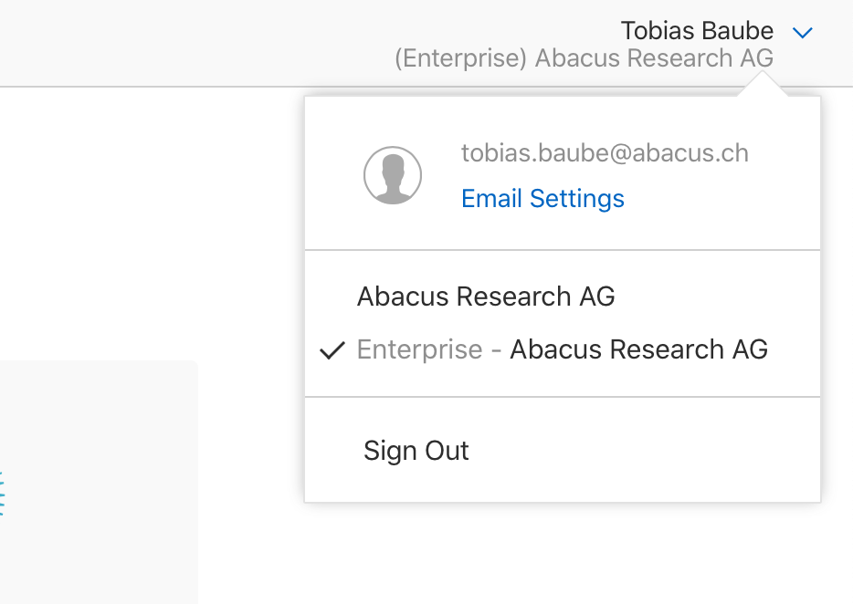
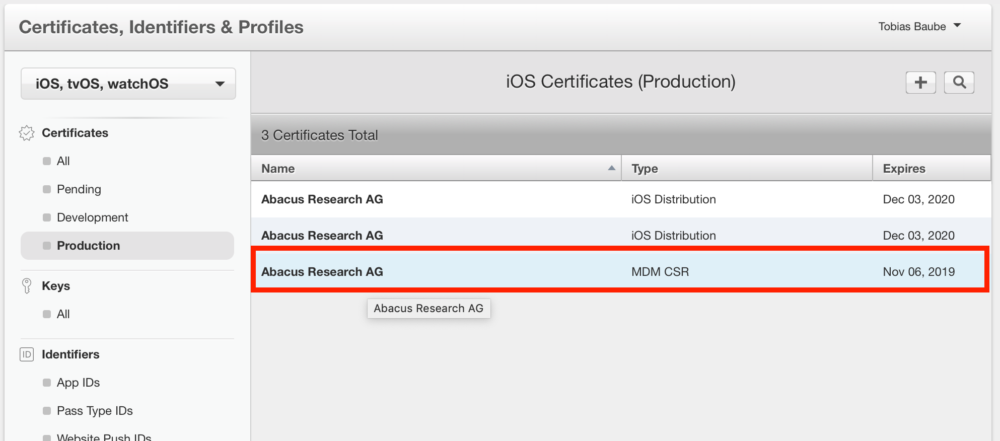
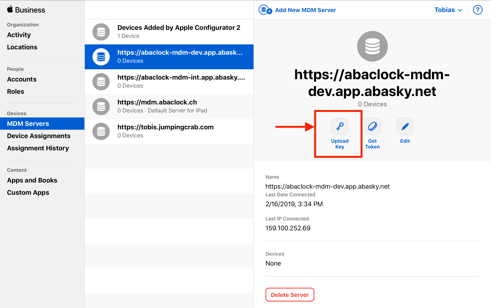

# MicroMDM - Abacus
In addition, to official README of the source project: https://github.com/micromdm/micromdm

## Requirements

Make sure, go version 1.11 or newer is installed:
`go version`

For testing, install `goose`
`brew install goose`

## Compiling
Run build in root directory of the project
`make build`

Will generate our executables in 
```
./build/darwin
./build/linux
```

Will also generate a `docker-compose-dev.yaml` file, for further configuration.

Choose your system (darwin/linux) and go to the directory.

```
# Executable for configuration and setup
./build/(darwin|linux)/mdmctl

# Executable for running the server
./build/(darwin|linux)/micromdm
```

## Testing
### Mysql - Only for Test environment!
#### Setup test account:
* username: micromdm
* password: micromdm
```
mysql -u root
mysql> CREATE USER 'micromdm'@'localhost' IDENTIFIED BY 'micromdm';
mysql> GRANT ALL PRIVILEGES ON *.* TO 'micromdm'@'localhost' IDENTIFIED BY 'micromdm';
```
#### Run tests
```
make db-mysql-migrate-test
make db-mysql-test
```

## Setup / Update micromdm.db
Once a year certificates need to be updated. Please perform the following 2 steps\
1. Assign Apple DEP Token
2. Assign Apple Push Certificate (APNS Cert)

Use the updated/generated `micromdm.db`and provide it as secret in your OpenShift Cluster.

### mdmctl 
#### Configure later MDM Service
```
./mdmctl config set \
    -api-token secret \
    -name mdmexample \
    -server-url https://mdm.abacus.ch/
./mdmctl config switch -name mdmexample
```

#### Assign Apple DEP Token
1. Generate public key
```
./mdmctl get dep-tokens \
    -export-public-key ../../assets/mdm-certificates/dep_public_key.pem
```
2. Get DEP Token from business.apple.com
   1. Upload File from `./assets/mdm-certificates/dep_public_key.pem` to https://business.apple.com
   2. Download now the p7m file, which we will import to the mdm server, save as `./assets/mdm-certificates/dep_token.p7m`
   3. Set DEP Token for server:
   ```
   ./mdmctl apply dep-tokens \
       -import ../../assets/mdm-certificates/dep_token.p7m
   ```
3. Make sure, import worked --> result returned for
```
./mdmctl get dep-tokens
```

#### Assign Apple Push Certificate (APNS Cert)
To assign an Apple Push Certificate, start the server first (no Mysql database connection required, we won't store the certificate in the Mysql database, but locally in a document store.)
We will need two Terminals/Consoles.

Run following command in Terminal 1
```
sudo ./micromdm serve \
    -config-path $(echo $(pwd)/../../build/) \
    -api-key secret \
    -tls-cert ./fullchain.pem \
    -tls-key ./privkey.pem \
    -server-url https://mdm.abacus.ch/
```

Now, when the server is running, add the Push certificate, from Terminal 2.
```
./mdmctl mdmcert upload \
    -password secret \
    -cert ../../assets/mdm-certificates/MDM_Abacus_Research_AG_Certificate.pem \
    -private-key ../../assets/mdm-certificates/PushCertificatePrivateKey.key
```

### micromdm locally
After configuring the MDM Service, run it.

```
sudo ./micromdm serve \
    -config-path $(echo $(pwd)/../../assets/) \
    -api-key secret \
    -tls-cert ./fullchain.pem \
    -tls-key ./privkey.pem \
    -server-url https://mdm.abacus.ch/ \
    -command-webhook-url http://127.0.0.1:5000/webhook \
    -mysql-username micromdm \
    -mysql-password micromdm \
    -mysql-database micromdm_test \
    -mysql-host 127.0.0.1 \
    -mysql-port 3306
```

### BoltDB - Document Store
Currently, some data is still being stored in the Mysql independant document store.\
If you run this MDM in OpenShift, this file needs to be provided as "secret" in OpenShift.\
`./assets/micromdm.db`

By using the Bolter
`bolter -f ./assets/micromdm.db`

#### Certificates
mdm.ServerConfig

#### DEP Token from Apple (.p7m)
mdm.DEPToken

#### scep_certificates
scep_certificates

## Operations
### Build with Docker File
Use ./Dockerfile to run the docker build
```
docker build . -t micromdm
```
### Run
Provide the path to the micromdm.db as variable `/data`
Due to our reverse proxy, we won't provide
* tls-cert
* tls-key

```
docker run -v /absolute/path/to/micromdm/assets/:/data  micromdm \
    micromdm serve \
    -config-path /data \
    -api-key secret \
    -server-url https://mdm.abacus.ch/ \
    -command-webhook-url http://127.0.0.1:5000/webhook \
    -mysql-username micromdm \
    -mysql-password micromdm \
    -mysql-database micromdm_test \
    -mysql-host 127.0.0.1 \
    -mysql-port 3306
```
## Certificate Updates
There are three certificates with expiration date +1 year in place:
1. MDM Certificate
2. APNS Certificate
3. DEP Token

### MDM Certificate

---
**NOTE**

Concerning Apple this certificate does not have to be renewed. I am not quite sure about this statement yet / Don't trust it. As a certificate that can expire and still be used for the `APNS Certificate`step does not really make sense...

---

The MDM Certificate is provided via Apple's Enterprise Developer Program. We had to request to get access to this program with our Team Administrator account. Steps to update this certificate:
1. Open https://developer.apple.com/account/ios/certificate
2. Make sure you selected the Enterprise team in the top right 
3. Select Certificates --> Production and Update the "MDM CSR" 
4. Run the command in Terminal. Make sure you got the right configuration for `mdmctl`
```
# Make sure the right configuration is selected
./mdmctl config switch -name mdmexample

# Request new certificate from our MDM Server
./mdmctl mdmcert vendor \
    -password=secret \
    -email=tobias.baube@abacus.ch \
    -country=CH
```
5. Upload `VendorCertificateRequest.csr` for `MDM CSR` on developer.apple.com with enter
6. Download `MDM Cer` to ./mdm-certificates/mdm.cer
7. Update the certificate and sign it
```
./mdmctl mdmcert push \
    -password=secret \
    -email=tobias.baube@abacus.ch \
    -country=CH
./mdmctl mdmcert vendor \
    -sign \
    -password=secret \
    -cert mdm-certificates/mdm.cer
```
8. Then renew the APNS Push Cert with downloaded `.plist` on https://identity.apple.com/pushcert/ - see APNS Certificate

### APNS Certificate
---
**NOTE**

This token may **NOT** expire and should **never** be revoked. Any enrolled iPads will not be reachable anymore by our server and would have to be enrolled again.

---

The APNS Certificate is the one we use to send Push notifications to the iPad via the Apple Push Notification Services.
1. Open https://identity.apple.com/pushcert/
2. The APNS Certificates are already set up. No need to create a new one. Instead **renew** the certificate. Do **NOT** Revoke this certificate or let it expire. Else we cannot reach the iPads anymore.
3. Select the Certificate you want to `renew`
4. Upload `.plist` from `MDM Certificate`
6. Download `.pem` file and store it as `MDM_Abacus_Research_AG_Certificate.pem` in your `./mdm-certificates` folder.
5. Update the certificate on the server. You **don't** have to restart the server, the update takes place immediately.
```
# Make sure the right configuration is selected
./mdmctl config switch -name mdmexample

# Request new certificate from our MDM Server
./mdmctl mdmcert upload \
    -password secret \
    -cert ./mdm-certificates/MDM_Abacus_Research_AG_Certificate.pem \
    -private-key ./mdm-certificates/PushCertificatePrivateKey.key

```

### DEP Token

---
**NOTE**

This token may expire but should be renewed.

---

If this Token was expired, its not too much of a problem. Enrolled iPads still can be reached and iPads that shall enroll as new iPads might have trouble. If we setup a new Token, it will work just fine again.

1. Open https://business.apple.com
2. Login with Admin Account
3. Select the Server you want to update in `MDM Servers`
4. Select `Upload Key` 
5. Get public key from our MDM Server
```
# Make sure the right configuration is selected
./mdmctl config switch -name mdmexample

# Request public key and store it
./mdmctl get dep-tokens \
    -export-public-key ~/Documents/dep_public_key.pem
```

6. Upload public key to https://business.apple.com
7. Download now the `.p7m` file, which we will upload to the mdm server. Rename it to `dep_token.p7m`
```
./mdmctl apply dep-tokens \
    -import ~/Downloads/dep_token.p7m
```
8. Make sure, import worked --> result returned for
``` 
./mdmctl get dep-tokens
```

